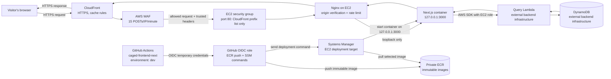

# CAGED Frontend Terraform

Terraform infrastructure for the CAGED Next.js frontend MVP. The approved
architecture is CloudFront and AWS WAF in front of one EC2 instance running
host Nginx and a loopback-bound Next.js container.

## Structure

- `environments/shared/`: explicitly account-level resources, including GitHub
  OIDC provider ownership.
- `environments/dev/`: the active infrastructure composition root and its
  independent Terraform state.
- `environments/prod/`: a future independent root, added with production
  implementation rather than as empty placeholders.
- `modules/`: cohesive reusable infrastructure domains.
- `templates/`: idempotent EC2 user data and readable Nginx configuration.
- `bootstrap/`: standalone remote-state backend bootstrap configuration.

This follows the backend repository's environment/module separation while
keeping this frontend's modules domain-sized rather than creating thin wrappers.

See `SPEC.md` for the approved architecture and `AGENTS.md` for implementation
and validation rules.

### Why the origin-verification header exists

The EC2 security group is the first protection: port 80 accepts connections
only from AWS's managed CloudFront origin-facing prefix list. Nginx adds a
second protection. Terraform generates a random value, stores it as an SSM
SecureString, and Nginx reads it locally during EC2 bootstrap. The value is not
an output, not committed to Git, and not placed into the Terraform-rendered
user-data script.

CloudFront's origin configuration adds that same value as
the private `X-Caged-Origin-Verify` header on requests sent to EC2. Nginx
returns `403` if the header is missing or wrong, before proxying to Next.js.
So even another CloudFront distribution—or someone who somehow reaches the
origin network address—cannot use the origin without knowing the generated
secret. The header protects the **CloudFront-to-origin** hop; visitors never
see it and do not send it themselves.

## Remote state

The standalone `bootstrap/` root creates the protected S3 state bucket. After
bootstrapping, initialize the development root with the generated bucket name
and the uncommitted `environments/dev/backend.hcl` configuration. Native S3
lockfiles are enabled; DynamoDB locking is not used.

## Team setup: development environment

Every developer and CI runner must initialize the development root against the
shared S3 backend before using Terraform. This lets Terraform see and lock the
same state for every team member.

### Prerequisites

- Terraform 1.10 or newer.
- AWS credentials for the intended account and Region.
- IAM permission to read and write the development state object and lockfile,
  plus the least-privilege infrastructure permissions assigned to the role.
- The shared backend bucket name from the team's approved onboarding channel.

### First-time setup

1. Clone the repository.
2. Create a local backend configuration from the committed example:

   ```bash
   cp environments/dev/backend.hcl.example environments/dev/backend.hcl
   ```

3. Replace the placeholder `bucket` value with the shared state-bucket name.
   Do not commit `backend.hcl`; it is ignored intentionally.
4. Initialize the development root:

   ```bash
   terraform -chdir=environments/dev init -backend-config=backend.hcl
   ```

5. Confirm Terraform can read the shared state without changing infrastructure:

   ```bash
   terraform -chdir=environments/dev plan
   ```

After initialization, Terraform records the backend locally under the ignored
`.terraform/` directory. Normal `plan`, `apply`, and `state` commands then use
the shared S3 state automatically.

## Backend Lambda contract

The query Lambda is owned by `caged-aws-iac`, not by this repository. For now,
the development root receives its qualified alias ARN from the ignored local
`environments/dev/terraform.tfvars` file. The value is currently available as
the backend root output named `query_alias_arn`.

```hcl
# environments/dev/terraform.tfvars -- ignored by Git
query_lambda_alias_arn = "arn:aws:lambda:us-east-1:123456789012:function:caged-dev-query:dev"
```

Use an alias ARN rather than a plain function ARN so the future EC2 role is
limited to an intentional backend release. This identifier is not a secret,
but the local file stays uncommitted because it is account-specific.

Later, the backend repository can publish this ARN to a non-secret AWS Systems
Manager Parameter. This frontend root can then read only that parameter instead
of receiving a local value, without granting it access to the backend's full
Terraform state.

### Safe daily workflow

Always review the shared-state plan before changing infrastructure:

```bash
terraform -chdir=environments/dev plan
terraform -chdir=environments/dev apply
```

Only run `apply` after the plan is reviewed and the change is authorized. S3
native lockfiles prevent simultaneous applies, but they do not replace code
review or least-privilege IAM permissions.

## First infrastructure deployment

Run these commands from the repository root after completing the team setup
above. Saving the plan makes the final apply use exactly the reviewed changes;
the generated `dev.tfplan` file is ignored by Git.

```bash
git status
terraform fmt -check -recursive
terraform -chdir=environments/dev init -backend-config=backend.hcl
terraform -chdir=environments/dev validate
terraform -chdir=environments/dev plan -out=dev.tfplan
terraform -chdir=environments/dev show dev.tfplan
```

Apply only after reviewing the displayed plan:

```bash
terraform -chdir=environments/dev apply dev.tfplan
```

Inspect the created non-secret operational values afterward:

```bash
terraform -chdir=environments/dev output
```

This creates billable resources including the EC2 instance, public IPv4/Elastic
IP, WAF, CloudFront usage, and ECR storage. The infrastructure deployment does
not deploy the Next.js image: until the frontend image is pushed to ECR and
started on EC2, CloudFront dynamic requests can return an origin error.

## Future infrastructure deployments

After the first successful initialization, Terraform remembers the shared S3
backend in the ignored `.terraform/` directory. You normally do **not** rerun
`init`; rerun it only when Terraform reports that the backend, providers, or
module sources changed.

For every reviewed infrastructure change, use this workflow:

```bash
git pull --ff-only
terraform fmt -check -recursive
terraform -chdir=environments/dev validate
terraform -chdir=environments/dev plan -out=dev.tfplan
terraform -chdir=environments/dev show dev.tfplan
terraform -chdir=environments/dev apply dev.tfplan
```

The commands are almost the same as the first deployment. The difference is
the plan: later changes can update resources in place, replace resources, or
destroy resources. Pay special attention to any replacement of EC2, Elastic IP,
CloudFront, WAF, IAM/OIDC resources, or the state backend. Changing a component
control from `1` to `0` intentionally plans deletion of that entire component.

Never use `-target` as a normal shortcut, and never apply an unreviewed plan.

## Component controls

`environments/dev/component_controls.tf` contains numeric `0`/`1` controls for each
deployable component. A value of `1` creates the component; `0` proposes its
destruction on the next approved apply. Controls gate whole modules, not their
individual dependent resources, so the VPC, subnet, routing, and security group
are switched together. Always run and review `terraform plan` after changing a
control.

Controls also enforce their prerequisites during input validation. For example,
`enable_frontend_host = 1` requires both `enable_network = 1` and
`enable_container_registry = 1`; Terraform reports a fatal validation error for
an invalid combination, so it cannot be applied. Terraform may still display a
partial plan for independent components before reporting that error.

### Frontend host identity

`enable_frontend_host` creates the IAM role, instance profile, one EC2 origin,
and its stable Elastic IP as one component. The role grants only Systems
Manager Session Manager access, pull access to this project's ECR repository,
and direct invocation of the configured query Lambda alias.

The host now uses an encrypted GP3 root volume, mandatory IMDSv2 tokens, no SSH
key, and an Elastic IP reserved only for the future CloudFront origin. Its IMDS
hop limit is `2`, which lets the loopback-bound Docker runtime obtain the same
temporary instance-role credentials without enabling IMDSv1. Nginx accepts the
origin request only when the network source is CloudFront and CloudFront sends
the generated verification header. It also requires the trusted
`CloudFront-Viewer-Address` header and applies an exact 15-per-minute rate
limit to POST requests, returning `429` when the small burst allowance is
exceeded. CloudFront configuration to send these headers is the next edge
delivery step.

The Ubuntu 24.04 bootstrap installs Docker, Nginx, `curl`, and the official AWS
CLI v2 bundle. It verifies each required command before continuing. Ubuntu's
SSM Agent uses the Snap service
`snap.amazon-ssm-agent.amazon-ssm-agent.service`, which the bootstrap verifies
before it relies on Parameter Store. A failure stops cloud-init early instead
of leaving an apparently created but unusable deployment host.

### Custom CloudFront domain

The custom-domain workflow uses a free, non-exportable public ACM certificate
in `us-east-1`. This certificate type is managed by AWS for CloudFront and is
not a manually imported or exportable certificate.

Request and validate the certificate before enabling the CloudFront hostname.
For a DNS zone managed outside AWS, the initial certificate request uses the
same configuration in the ignored `terraform.tfvars` file:

```hcl
enable_custom_domain = 1
viewer_domain_name  = "dataempregos.example.com"
```

After applying the reviewed plan, retrieve the required DNS validation CNAME:

```bash
terraform -chdir=environments/dev output frontend_custom_domain_validation_records
```

Create that CNAME in the authoritative DNS provider and wait until ACM marks
the certificate as issued. Then apply the same configuration again: Terraform
attaches the issued certificate and hostname to CloudFront. Finally, add the
separate public DNS CNAME that routes the custom hostname to the CloudFront
distribution. Do not remove ACM's validation CNAME; ACM uses it to renew the
certificate automatically.

## Frontend image retention

The private ECR repository stores immutable frontend release images. Its
lifecycle policy permanently retains the three newest tagged images for
rollback and expires untagged images after three days to control storage cost.
Terraform does not build or push images; the frontend deployment workflow does
that after the repository is available.

## Frontend runtime configuration

The EC2 host owns one non-secret SSM Parameter Store `String` per environment:
`/caged/dev/frontend/runtime-env`. Terraform renders its value as an env-file
containing the AWS Region, qualified query-Lambda alias ARN, and the public
source, GitHub, and contact links required by Next.js. The actual parameter
value is never an output.

During an application deployment, the SSM command runs on EC2 and the instance
role reads this exact parameter before Docker starts the container with it as an
env-file. GitHub Actions does not receive the runtime values; it only assumes
the restricted OIDC role to push an immutable image and request the SSM command.
This keeps account-specific server configuration out of the image, Git history,
and the browser bundle.

The GitHub organization uses a customized OIDC subject containing immutable
owner and repository IDs. The deployment role trust policy must match the
subject emitted by the `dev` environment job exactly; do not replace it with
the default repository-name-only subject during IAM maintenance.

The deployment role can send a command only to the configured EC2 instance and
`AWS-RunShellScript` document. AWS does not offer a command-invocation ARN for
`ssm:GetCommandInvocation`, so that read permission uses `Resource: "*"` but is
limited to the deployment Region.

After the approved Terraform apply, the frontend repository can store the
following **non-secret** GitHub `dev` environment variable for its deployment
workflow:

```bash
terraform -chdir=environments/dev output -raw frontend_runtime_environment_parameter_name
```

The workflow passes that parameter name to its SSM deployment script. The
script runs on EC2, where the instance role retrieves the value; it must never
print the env-file or give GitHub permission to read it.

Terraform also maintains `/caged/dev/frontend/deployment-target-instance-id`, a
non-secret String containing the current EC2 instance ID. GitHub reads only
this stable parameter path through its OIDC role before deployment, avoiding a
manually maintained instance ID after a host replacement.

## Edge protection

`enable_edge_delivery` creates the CloudFront-scoped WAF foundation in
`us-east-1`. Its single rule tracks source IP addresses, evaluates only POST
requests over 60 seconds, and returns `429` after 15 requests. CloudWatch
metrics and sampled requests are enabled; CloudFront itself is added in the
next edge-delivery increment and will attach this web ACL.

## Flowchart

All AWS infrastructure shown below is now deployed in the development account.
The Next.js container and its GitHub Actions workflow are the next application
repository work; until an image is deployed, dynamic requests can return an
origin error.


