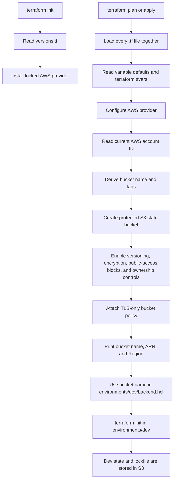

# Remote-state bootstrap

This standalone Terraform root creates the S3 backend for frontend Terraform
state. It remains separate because the development root cannot create the
backend that stores its own state.

The bucket has versioning, SSE-S3 encryption, public-access blocks, enforced
bucket ownership, a TLS-only bucket policy, and lifecycle protection against
Terraform destruction. No expiration lifecycle rule is configured, so current
and noncurrent state versions remain until an explicitly authorized deletion.
Native S3 lockfiles protect the development state; no DynamoDB lock table is
created.

## Bootstrap procedure

1. Copy `terraform.tfvars.example` to an uncommitted `terraform.tfvars` and
   set the AWS Region and optional bucket-name override.
2. Run `terraform -chdir=bootstrap init`, review a plan, and apply only with an
   explicitly authorized AWS account.
3. Copy `environments/dev/backend.hcl.example` to the ignored
   `environments/dev/backend.hcl`, replacing `bucket` with the
   `state_bucket_name` output.
4. Run `terraform -chdir=environments/dev init -backend-config=backend.hcl`.

## Bootstrap files

| File | Responsibility | Relationship to the other files |
| --- | --- | --- |
| `versions.tf` | Pins the Terraform and AWS provider compatibility range. | Terraform reads this before it can install the AWS provider during `init`. |
| `providers.tf` | Configures the AWS provider and default resource tags. | Uses `aws_region` from `variables.tf` and `tags` from `locals.tf`. |
| `variables.tf` | Defines the safe, typed inputs for the bootstrap. | Values come from defaults or the uncommitted `terraform.tfvars` file. |
| `terraform.tfvars.example` | Shows safe example input values. | Copy it to the ignored `terraform.tfvars` file before the first plan. |
| `locals.tf` | Looks up the current AWS account and derives names and mandatory tags. | Its values are used by the provider and S3 resources. |
| `main.tf` | Declares the protected S3 bucket and its security controls. | References variables and locals; creates the resources during `apply`. |
| `outputs.tf` | Prints non-secret facts about the created bucket. | `state_bucket_name` is copied into the development backend configuration. |
| `.terraform.lock.hcl` | Records the exact AWS provider version and checksums selected by `init`. | Generated by Terraform; commit it, but never edit it manually. |
| `README.md` | Explains how to bootstrap and connect the development root. | Documents the purpose and flow of every file in this directory. |

## How Terraform reads and applies the bootstrap

Terraform loads every `.tf` file in `bootstrap/` as a single configuration;
filenames organize the code for people, not execution order. It then uses the
references between blocks to build a dependency graph.

The bootstrap root begins with local state because it creates the S3 bucket
that would otherwise store its own initial state. Do not commit the bootstrap
state file; protect it until an approved migration strategy is in place.
